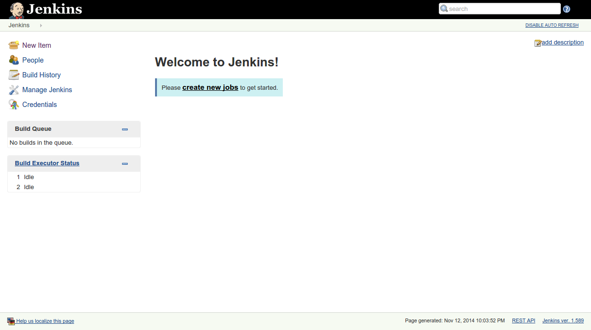
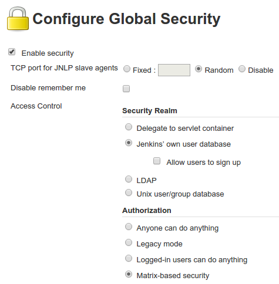
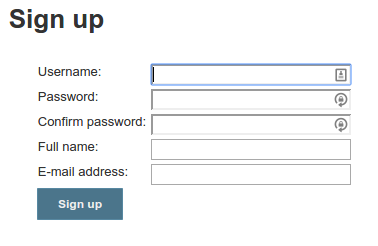

# Getting started with Jenkins

Before you continue reading this guide why not try a more easy way, using the [Koding Package Manager (kpm)](http://learn.koding.com/guides/getting-started-kpm/) and install Jenkins using just one command:

```
kpm install jenkins
```

***

This guide will cover the basics on how to install and configure Jenkins on your Koding VM. Just follow the steps and you should have Jenkins running in no time.

## Installing Jenkins

The first thing you need to do before you install Jenkins is to make sure you add the key and source list to apt. Using the following commands you will be able to do just that.

_Note: you should be logged in as root to continue with the following steps._

First add the key:

```
wget -q -O - http://pkg.jenkins-ci.org/debian/jenkins-ci.org.key | apt-key add -
```

Create the sources list:

```
echo deb http://pkg.jenkins-ci.org/debian binary/ > /etc/apt/sources.list.d/jenkins.list
```

After you finished with the above commands update apt like so:

```
apt-get update
```

You can now install Jenkins using the following command:

```
apt-get install jenkins
```

_Please note that Jenkins has a lot of dependencies, so it might take some time to install them all._

## Configuring Jenkins

Jenkins should now be running properly. Head over to your VMs assigned URL (If you don't know what's your VM URL follow [this guide](/faq/vm-hostname) to find out) and append `:8080` to it. That is where Jenkins currently resides.



The above image shows the default screen when you first open Jenkins.

Jenkins, by default, is insecure and everyone can access it. Head over to Manage Jenkins (in the left menu) then click Setup Security.


Follow these steps to secure your Jenkins installation:



1. The first thing you need to do is to enable the security setting by checking it.
2. Now check the box to use Jenkins's own user database and disable sign ups.
3. Next, check the box for Matrix-based security and make sure Anonymous only has the Read right under the View group.
4. Click save. The page should reload and you'll see a login form. You should ignore that.
5. Head over to your VMs URL follow by `:8080`. You'll see a sign up form.



Sign up and this process should give administrative clearance for your Jenkins installation.

If you have any question or issues please email us at support@koding.com and we'll gladly help.